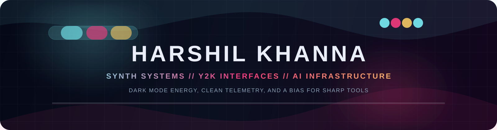

<div align="center">



<table align="center">
<tr>
<td><a href="https://www.linkedin.com/in/harshil-khanna-542540315/"></a></td>
<td><a href="mailto:khannaharshil2289@gmail.com"></a></td>
<td><a href="https://github.com/HarshilKhanna"></a></td>
</tr>
</table>

</div>

<br/>

## About

```yaml
status: building synthy systems with practical Y2K energy
role: Computer Science Engineering student at Vellore Institute of Technology
focus: distributed systems, backend architecture, applied AI, RAG
current: DocGraph AI, PingU, observability tooling, microservice platforms
history: HPE, AIBlocks, Ernst & Young
```

<br/>

## Core Stack

<div align="center">

**Languages**
<br/>


<br/><br/>

**Backend**
<br/>


<br/><br/>

**Frontend**
<br/>


<br/><br/>

**Data**
<br/>


<br/><br/>

**AI / ML**
<br/>


<br/><br/>

**DevOps**
<br/>


</div>

<br/>

## Featured Builds

<table>
<tr>
<td width="50%" valign="top">

**[DocGraph AI](https://github.com/HarshilKhanna/DocGraph)**
<br/>
GraphRAG document intelligence with HNSW vector search, semantic graph traversal, and an async FastAPI backend on the Gemini Batch API.
<br/><br/>
`Python` `FastAPI` `Neo4j` `Gemini API` `React`

</td>
<td width="50%" valign="top">

**[PingU](https://github.com/HarshilKhanna/PingU)**
<br/>
Distributed uptime and API monitoring platform built around 7 microservices, RabbitMQ, and 4 global regions.
<br/><br/>
`Next.js` `FastAPI` `TimescaleDB` `RabbitMQ` `Docker`

</td>
</tr>
<tr>
<td width="50%" valign="top">

**[Baremetal AI](https://github.com/HarshilKhanna/Baremetal-AI)**
<br/>
Local-first VS Code extension for AI code auditing that runs fully on-device through Ollama.
<br/><br/>
`TypeScript` `VS Code API` `Ollama`

</td>
<td width="50%" valign="top">

**Current Focus**
<br/>
Observability, distributed systems, and production-grade AI workflows with clean telemetry and low-latency design.
<br/><br/>
`Microservices` `Observability` `Docker`

</td>
</tr>
</table>

<br/>

## Activity Feed

<div align="center">

</div>

<br/>

<div align="center">
<sub>snake animation appears after the workflow runs and publishes the <code>output</code> branch</sub>
</div>